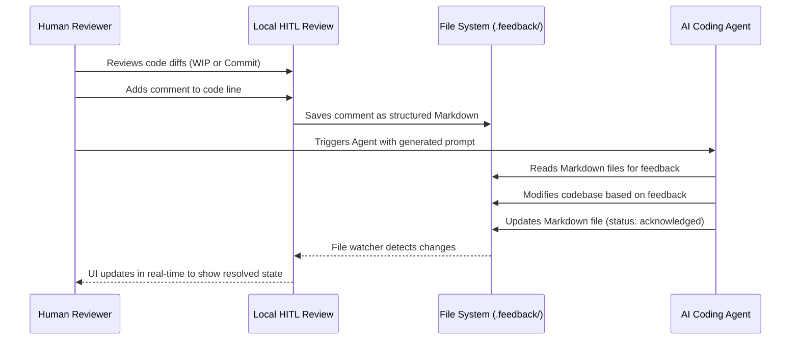

# Local HITL Review

> Human-in-the-loop local code reviews without needing Draft PRs.

[](https://github.com/pabloubal/local-hitl-review/releases/latest)
[](https://github.com/pabloubal/local-hitl-review/releases/latest)
[](LICENSE)

<a href="https://github.com/pabloubal/local-hitl-review"></a>

Tiny VS Code extension that keeps **the human in the loop** for AI code reviews, completely offline. Leave structured feedback, flag lines of code, and manage review states without ever needing to push a Draft PR to GitHub. One dedicated Source Control view, native Editor commenting, and fully readable markdown outputs for your AI Agents to process.

- **Draftless Reviews.** Review code locally before it ever leaves your machine.
- **Agent-Ready Feedback.** Comments are saved seamlessly in a `.feedback` directory as structured Markdown, ready to be read and addressed by your AI coding agents.
- **Native VS Code UI.** Uses VS Code's native Commenting API and Source Control views. Nothing new to learn.
- **Multi-Repository Support.** Manage feedback seamlessly across multi-root workspaces.
- **Commit History & Diffs.** View commit graphs and leave feedback on specific commits or work-in-progress changes.
- **Copy Agent Prompt.** Generate and copy tailored prompts based on your feedback directly to your AI assistant.
- **Privacy-first.** Everything happens locally on your machine.

### Installation

Requires VS Code 1.100+. Download the latest `.vsix` from [GitHub Releases](https://github.com/pabloubal/local-hitl-review/releases).

**Via Terminal:**
```bash
curl -sL $(curl -s https://api.github.com/repos/pabloubal/local-hitl-review/releases/latest | jq -r '.assets[0].browser_download_url') -o local-hitl-review.vsix && code --install-extension local-hitl-review.vsix && rm local-hitl-review.vsix
```

**Via VS Code UI:**
1. Open the Extensions panel (`Cmd+Shift+X`).
2. Click the `...` menu in the top right.
3. Select **"Install from VSIX..."** and choose the downloaded file.

### First Run

1. Open the **Source Control** view. You will see a new **Local HITL Review** panel.
2. Click the **Initialize Feedback Workspace** button (folder icon) at the top of the panel to automatically scaffold your `.feedback` directory.
3. Use the **Select Base Branch** button to choose which branch to compare against (e.g. `main`), or select specific commits from the commit history view.
4. Click on any changed file in the tree to open a Diff view. 
5. Click the `+` button in the gutter of the diff to leave a comment!
6. Generate AI prompts using the **Copy Agent Prompt** command to easily hand off tasks to your AI coding assistants.

### How it Works

The lifecycle of a review feedback loop flows seamlessly between you, the extension, and your AI Agent:



When you leave a comment, it is saved as a Markdown file in the `.feedback/` directory at the root of your workspace (or repository for multi-root setups). 

```markdown
---
id: 1789681078-6ed3
file: src/extension.ts
lines: 14-16
severity: high
status: open
---
This function doesn't handle the edge case where `store` is null.
```

Your AI agents (like Cline, Cursor, or Aider) can simply read these files, implement the requested changes, and update the `status` to `acknowledged`. 
The extension automatically watches the `.feedback` directory and updates the UI in real-time, giving the thread a visual "Resolved" state as soon as the agent fixes the issue!
