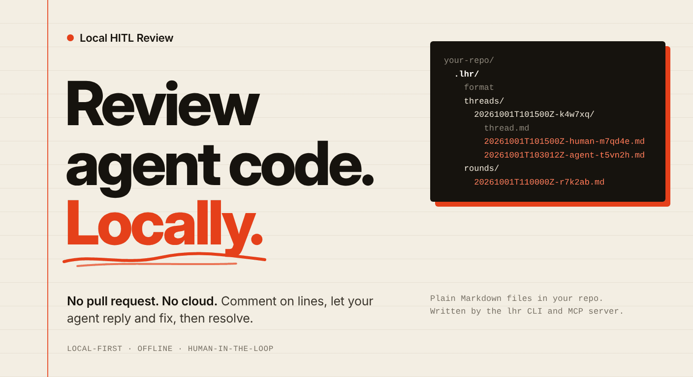
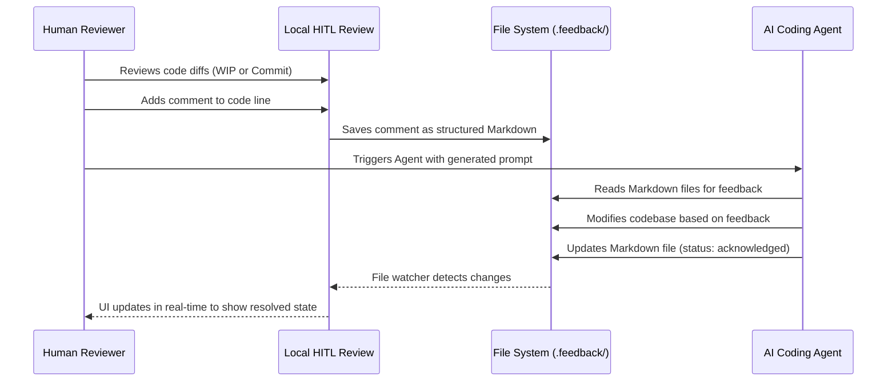

# Local HITL Review

> Human-in-the-loop local code reviews without needing Draft PRs.

[](https://github.com/pabloubal/local-hitl-review/releases/latest)
[](https://github.com/pabloubal/local-hitl-review/releases/latest)
[](LICENSE)

<a href="https://github.com/pabloubal/local-hitl-review"></a>

Local code review that keeps **the human in the loop** for AI-written code, completely offline. Leave structured feedback, flag lines of code, and manage review states without pushing a Draft PR to GitHub. Two front ends share one core:

- **VS Code extension** for the human reviewer: a Source Control view and native editor comments. See [VS Code extension](#vs-code-extension).
- **`lhr` CLI** (includes an MCP server) for terminals and AI agents: list, read, reply to and resolve review threads. See [`lhr` CLI](#lhr-cli).

## VS Code extension

The extension adds one dedicated Source Control view, native Editor commenting, and fully readable markdown outputs for your AI Agents to process.

- **Draftless Reviews.** Review code locally before it ever leaves your machine.
- **Agent-Ready Feedback.** Comments are saved seamlessly in a `.feedback` directory as structured Markdown, ready to be read and addressed by your AI coding agents.
- **Native VS Code UI.** Uses VS Code's native Commenting API and Source Control views. Nothing new to learn.
- **Multi-Repository Support.** Manage feedback seamlessly across multi-root workspaces.
- **Commit History & Diffs.** View commit graphs and leave feedback on specific commits or work-in-progress changes.
- **Copy Agent Prompt.** Generate and copy tailored prompts based on your feedback directly to your AI assistant.
- **Privacy-first.** Everything happens locally on your machine.

### Installation

Requires VS Code 1.100+. Download the latest `.vsix` from [GitHub Releases](https://github.com/pabloubal/local-hitl-review/releases).

**Via Terminal:**
```bash
curl -sL $(curl -s https://api.github.com/repos/pabloubal/local-hitl-review/releases/latest | jq -r '.assets[0].browser_download_url') -o local-hitl-review.vsix && code --install-extension local-hitl-review.vsix && rm local-hitl-review.vsix
```

**Via VS Code UI:**
1. Open the Extensions panel (`Cmd+Shift+X`).
2. Click the `...` menu in the top right.
3. Select **"Install from VSIX..."** and choose the downloaded file.

### First Run

1. Open the **Source Control** view. You will see a new **Local HITL Review** panel.
2. Click the **Initialize Feedback Workspace** button (folder icon) at the top of the panel to automatically scaffold your `.feedback` directory.
3. Use the **Select Base Branch** button to choose which branch to compare against (e.g. `main`), or select specific commits from the commit history view.
4. Click on any changed file in the tree to open a Diff view. 
5. Click the `+` button in the gutter of the diff to leave a comment!
6. Generate AI prompts using the **Copy Agent Prompt** command to easily hand off tasks to your AI coding assistants.

### How it Works

The lifecycle of a review feedback loop flows seamlessly between you, the extension, and your AI Agent:


```mermaid
sequenceDiagram
    participant Human as Human Reviewer
    participant VSCode as Local HITL Review
    participant FS as File System (.feedback/)
    participant Agent as AI Coding Agent

    Human->>VSCode: Reviews code diffs (WIP or Commit)
    Human->>VSCode: Adds comment to code line
    VSCode->>FS: Saves comment as structured Markdown
    Human->>Agent: Triggers Agent with generated prompt
    Agent->>FS: Reads Markdown files for feedback
    Agent->>FS: Modifies codebase based on feedback
    Agent->>FS: Updates Markdown file (status: acknowledged)
    FS-->>VSCode: File watcher detects changes
    VSCode-->>Human: UI updates in real-time to show resolved state
```

When you leave a comment, it is saved as a Markdown file in the `.feedback/` directory at the root of your workspace (or repository for multi-root setups). 

```markdown
---
id: 1789681078-6ed3
file: src/extension.ts
lines: 14-16
severity: high
status: open
---
This function doesn't handle the edge case where `store` is null.
```

Your AI agents (any coding agent) can simply read these files, implement the requested changes, and update the `status` to `acknowledged`. 
The extension automatically watches the `.feedback` directory and updates the UI in real-time, giving the thread a visual "Resolved" state as soon as the agent fixes the issue!

## `lhr` CLI

`lhr` (package `@pablou/lhr`, Node 22+) is the command-line front end. A human can review from a terminal; an agent reads its inbox, replies and resolves. It stores threads in a `.lhr/` directory at the review root.

```bash
npx @pablou/lhr --help        # run without installing
npm i -g @pablou/lhr          # or install the `lhr` binary
```

### Quick start

```bash
lhr init                                   # create .lhr/ in the current directory
lhr thread create src/auth.ts:42-47 --severity high --body "Handle expired sessions"
lhr review submit --verdict request-changes --summary "Two blockers"

lhr inbox                                  # open threads waiting on the agent
lhr thread list --status all
lhr thread show <id>
lhr thread reply <id> --body "Fixed in 3f2a9c1"
lhr thread resolve <id>
lhr thread reopen <id> --body "Still broken on Windows"
lhr check                                  # validate the whole .lhr/ tree
```

Thread `<id>` accepts the full ID or a short handle. Run `lhr <command> --help` for flags.

Global flags:

| Flag | Effect |
|------|--------|
| `--json` | Print the JSON envelope instead of text |
| `--as human\|agent` | Override the identity mode |
| `--dry-run` | Write commands only: validate, write nothing |
| `--repo <path>` | Start path for review-root discovery |

In human mode, `thread create` and `thread reply` save drafts, and `lhr review submit` turns them into a review round. Agents cannot submit rounds. Set `LHR_SESSION_ID` when running the CLI from an agent, or its writes are treated as human drafts. Full reference: [docs/spec/cli.md](docs/spec/cli.md).

### MCP server

`lhr mcp` runs an MCP server on stdio for agents without a shell. Register it with your MCP client, for example in `.mcp.json`:

```json
{
  "mcpServers": {
    "lhr": {
      "command": "npx",
      "args": ["-y", "@pablou/lhr", "mcp"]
    }
  }
}
```

Tools: `inbox`, `thread_list`, `thread_show`, `thread_reply`, `thread_resolve`, `thread_reopen`, `thread_create`. The server always acts as an agent and cannot submit reviews. One server serves one review root; pass `--repo <path>` to choose it. See [docs/spec/mcp.md](docs/spec/mcp.md).

### Agent integration

Give your agent the thin instructions in [`skills/lhr/`](skills/lhr):

- [`SKILL.md`](skills/lhr/SKILL.md): the full inbox, reply and resolve loop, for agents that load skills.
- [`AGENTS.snippet.md`](skills/lhr/AGENTS.snippet.md): a short block to paste into your `AGENTS.md` or `CLAUDE.md`.

## Where reviews are stored

The two front ends use different stores today:

- `lhr` and the shared core read and write `.lhr/` ([file format](docs/spec/file-format-v2.md), [ADR 0003](docs/adr/0003-thread-layout-on-disk.md)).
- The VS Code extension reads and writes `.feedback/` (`.review` files, described above). It does not read `.lhr/`, and nothing converts between the two. Threads created in one are not visible in the other.

## Repository layout and contributing

npm workspaces monorepo ([ADR 0004](docs/adr/0004-repo-layout.md)):

| Path | Contents |
|------|----------|
| `packages/core` | File format, anchoring, git access, review rounds |
| `packages/cli` | The `lhr` binary, including `lhr mcp` |
| `packages/vscode` | The VS Code extension |
| `skills/` | Agent skill and `AGENTS.md` snippet |

Contribution rules are in [AGENTS.md](AGENTS.md). Changes that alter what a user or agent sees update the live-verification skills in `.claude/skills/verify-hitl-review` (extension) and `.claude/skills/verify-lhr` (CLI and MCP). Background: [docs/VISION.md](docs/VISION.md) and [docs/adr](docs/adr).
